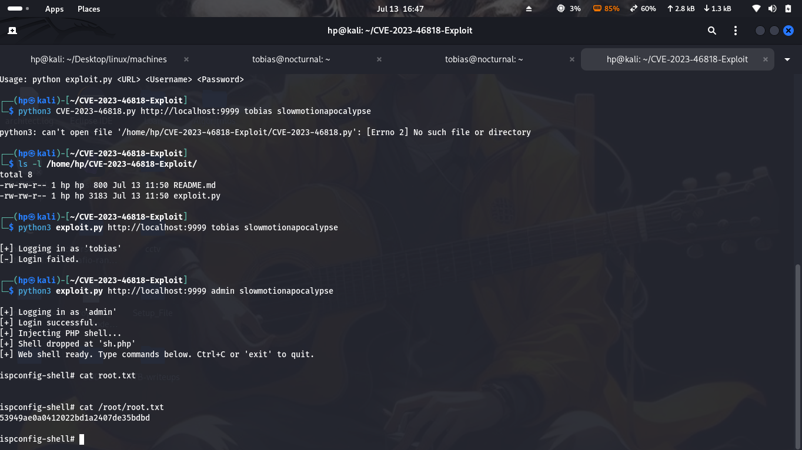

<<<<<<< HEAD
# Primer paso.Escaneo de Puertos con Nmap. 10.10.11.64

 Se observa Web clasica + ssh

 # HTTP 10.10.11.64:80
 - Correo encontrado : "support@nocturnal.htb"
 
 - tecnologia: PHP, NGINX 1.18.0, Ubuntu
 - No hay sqli en login.php
 - no hay robots.txt
- rutas encontradas:
- 
  /login.php
/register.php
/backups/
/uploads/
/admin.php
/view.php?username=admin2&file=upload1.pdf

Tras el registro (admin2:admin2), podemos subir archivos.

Solo se permiten archivos PDF, DOC, DOCX, XLS, XLSX y ODT.

Solo se verifica la extensión. Pruebe alguna alternativa para subir archivos PHP.

/view.php?username=amanda&file=.pdf

<a href="view.php?username=amanda&file=privacy.odt">privacy.odt</a>

Creds encontradas dentro del archivo odt: 'a[CENSURADO]J'

Amanda es administradora.

Ahora tenemos acceso a /admin.php.

Podemos crear una copia de seguridad con la base de datos.

En la base de datos tenemos el hash de Tobias:

55c8[REDACTED]061d

  cracked in crackstation: slowmotionapocalypse

  users:
        amanda:a[REDACTED]1J
        tobias:s[REDACTED]e
# ssh - tobias

Acceso de usuario como Tobias
Sendmail SUID extraño (no importante)
El puerto 8080 aloja otro sitio web
Reenviado mediante SSH tobias@nocturnal.htb -L 8081:127.0.0.1:8080

# HTTP - 127.0.0.1:8080

Servicio SPconfig, aplicación de administración del servidor.
Podemos acceder usando el usuario predeterminado admin y slowmotionapocalypse como contraseña.
Encontramos CVE-2023-46818 (https://github.com/bipbopbup/CVE-2023-46818-python-exploit/raw/refs/heads/main/exploit.py).
Para acceder como root, ejecutamos:

python3 exploit.py http://127.0.0.1:8081/ admin sl[REDACTED]se

 
=======
#First we do the nmap routine
What we see is: 
	Starting Nmap 7.95 ( https://nmap.org ) at 2025-10-11 16:04 -03
Nmap scan report for voleur.htb (10.10.11.76)
Host is up (0.21s latency).
Not shown: 65516 filtered tcp ports (no-response)
PORT      STATE SERVICE       VERSION
53/tcp    open  domain        Simple DNS Plus
88/tcp    open  kerberos-sec  Microsoft Windows Kerberos (server time: 2025-10-12 03:12:58Z)
135/tcp   open  msrpc         Microsoft Windows RPC
139/tcp   open  netbios-ssn   Microsoft Windows netbios-ssn
389/tcp   open  ldap          Microsoft Windows Active Directory LDAP (Domain: voleur.htb0., Site: Default-First-Site-Name)
445/tcp   open  microsoft-ds?
464/tcp   open  kpasswd5?
593/tcp   open  ncacn_http    Microsoft Windows RPC over HTTP 1.0
636/tcp   open  tcpwrapped
2222/tcp  open  ssh           OpenSSH 8.2p1 Ubuntu 4ubuntu0.11 (Ubuntu Linux; protocol 2.0)
| ssh-hostkey: 
|   3072 42:40:39:30:d6:fc:44:95:37:e1:9b:88:0b:a2:d7:71 (RSA)
|   256 ae:d9:c2:b8:7d:65:6f:58:c8:f4:ae:4f:e4:e8:cd:94 (ECDSA)
|_  256 53:ad:6b:6c:ca:ae:1b:40:44:71:52:95:29:b1:bb:c1 (ED25519)
3268/tcp  open  ldap          Microsoft Windows Active Directory LDAP (Domain: voleur.htb0., Site: Default-First-Site-Name)
3269/tcp  open  tcpwrapped
9389/tcp  open  mc-nmf        .NET Message Framing
49668/tcp open  msrpc         Microsoft Windows RPC
63831/tcp open  ncacn_http    Microsoft Windows RPC over HTTP 1.0
63832/tcp open  msrpc         Microsoft Windows RPC
63843/tcp open  msrpc         Microsoft Windows RPC
63851/tcp open  msrpc         Microsoft Windows RPC
63865/tcp open  msrpc         Microsoft Windows RPC
Service Info: Host: DC; OSs: Windows, Linux; CPE: cpe:/o:microsoft:windows, cpe:/o:linux:linux_kernel

Host script results:
| smb2-time: 
|   date: 2025-10-12T03:13:58
|_  start_date: N/A
|_clock-skew: 7h59m58s
| smb2-security-mode: 
|   3:1:1: 
|_    Message signing enabled and required

Service detection performed. Please report any incorrect results at https://nmap.org/submit/ .
Nmap done: 1 IP address (1 host up) scanned in 589.54 seconds
>>>>>>> d307be7 (Actualización: Diagrama FirstVoleur.drawio y README.md para Voleur)
